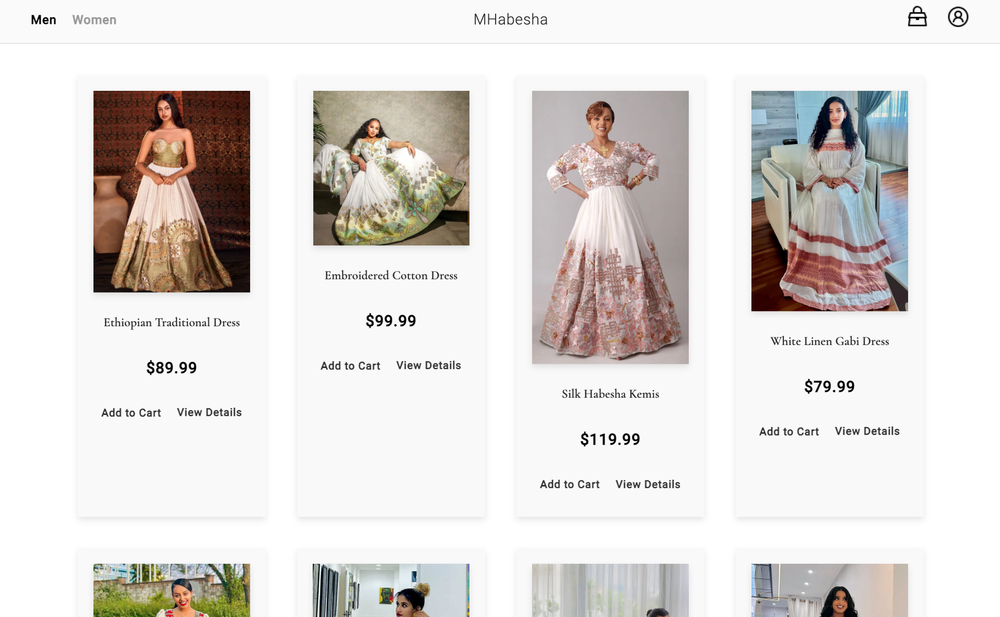
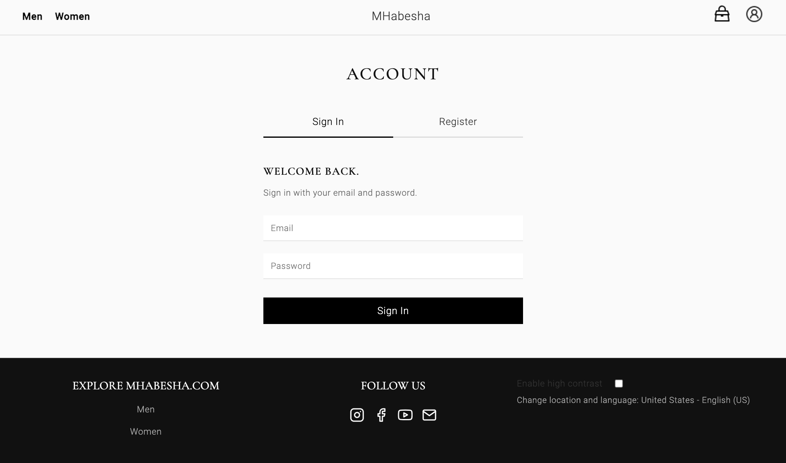
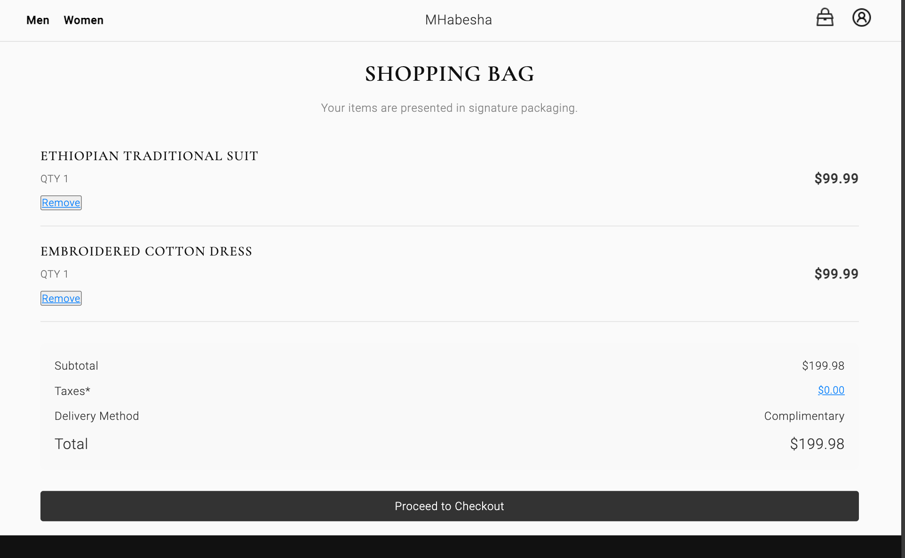
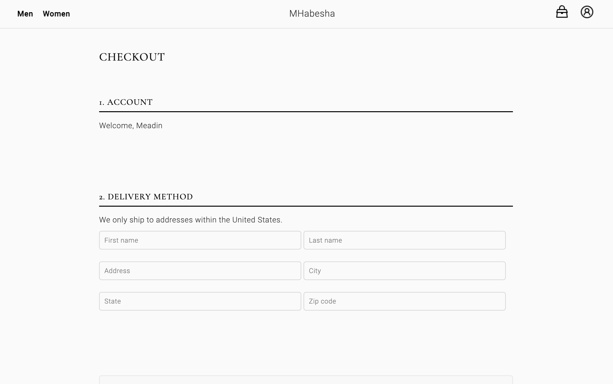

# MHabesha Clothing


## **Table of Contents**
1. [Overview](#overview)
2. [Features](#features)
   - [Fully Front-End Architecture](#fully-front-end-architecture)
   - [Local Storage](#local-storage)
   - [Responsive Design](#responsive-design)
   - [Inspired by High-End Brands](#inspired-by-high-end-brands)
   - [E-commerce Features](#e-commerce-features)
3. [Technologies Used](#technologies-used)
4. [Installation and Usage](#installation-and-usage)
5. [Screenshots](#screenshots)
6. [Live Demo](#live-demo)
7. [Conclusion](#conclusion)


## **Overview**
MHabesha Clothing is a modern, minimalist e-commerce website that showcases Ethiopian traditional clothing, allowing users to browse and shop for various styles. The website is **fully front-end** with a user-friendly interface inspired by high-end global brands like **Channel** and **Dior**. 

Built using **React.js**, **localStorage**, and **CSS**, the site provides a responsive, elegant shopping experience across devices, all without relying on backend technologies. This project reflects the fusion of modern web technologies with traditional Ethiopian designs.


## **Features**

### 1. **Fully Front-End Architecture**
   - **No Backend**: The website is built entirely on the client side, leveraging **React.js** for efficient rendering and state management.
   - **State Management**: Utilizes React's state hooks and localStorage to store user data (e.g., cart items and user details), ensuring a seamless user experience even after page refreshes.
   - **User Authentication Simulation**: While there is no server-side authentication, user data (like email) and cart information are saved locally using **localStorage** for persistent data.

### 2. **Local Storage**
   - Cart data and user details (such as the logged-in user's email) are stored securely in **localStorage**.
   - This ensures users can come back to the website and continue shopping where they left off without losing any progress.
   - **No database** is required—data is saved directly in the user's browser.

### 3. **Responsive Design**
   - The website is designed with a **mobile-first** approach to ensure it is fully responsive across all devices, from smartphones to desktops.
   - **Flexbox** and **CSS Grid** (with media queries) are used to ensure proper alignment and layout on smaller and larger screens.

### 4. **Inspired by High-End Brands**
   - The design and user interface are heavily inspired by high-end fashion brands, such as **Chanel** and **Dior**, ensuring that the website reflects sophistication, elegance, and simplicity.
   - The color palette is kept simple yet refined, and animations and transitions are used to provide a smooth and polished browsing experience.

### 5. **E-commerce Features**
   - **Product Pages**: Each product is displayed with detailed information (e.g., name, description, price) and high-quality images.
   - **Add to Cart**: Users can add products to the cart, adjust quantities, and proceed to checkout.
   - **Checkout Process**: A simple yet effective checkout process allows users to review their cart and proceed to the payment page (simulated in the project for demonstration purposes).


## **Technologies Used**

- **React.js**: The core framework used for building the website’s interactive user interface.
- **CSS (Flexbox, Grid)**: For responsive and modern styling, using a minimalist design.
- **localStorage**: To store cart items and user data across sessions.
- **JavaScript**: The primary scripting language for functionality such as adding/removing items from the cart and calculating totals.


## **Installation and Usage**

1. **Clone the Repository**
   - Clone the repository to your local machine using:
     ```bash
     git clone https://github.com/Meadoughnut/MHabesha.git
     ```

2. **Install Dependencies**
   - Navigate to the project directory and install dependencies:
     ```bash
     cd MHabesha
     npm install
     ```

3. **Run the Application**
   - Start the development server:
     ```bash
     npm start or npm run dev
     ```


## **Screenshots**

 
  
  
  
  


## **Live Demo**

You can view the live version of the project at:  
[Deployed Website Link](https://meadoughnut.github.io/MHabesha/)  


## **Conclusion**

MHabesha Clothing is a modern and efficient solution for showcasing traditional Ethiopian clothing, leveraging the latest front-end technologies to deliver a user-friendly, aesthetically pleasing experience. Built entirely with **React.js** and **localStorage**, this project highlights the power of client-side development and demonstrates how a visually stunning, functional website can be achieved without a backend.


